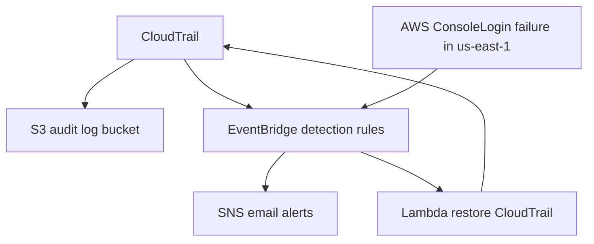

# SecureCloud Sentinel

SecureCloud Sentinel deploys AWS audit logging, event detection, email alerts, and automated CloudTrail recovery using Terraform.

## Overview

This project deploys a centralized CloudTrail audit trail and a private S3 log bucket. It detects sensitive AWS activity with EventBridge, sends alerts through Amazon SNS, and automatically restores CloudTrail when logging is stopped.

## Main features

- Private S3 audit log bucket with SSE-S3 (AES256) encryption
- S3 bucket versioning, lifecycle management, and public access block
- CloudTrail audit logging with log file validation
- EventBridge detection for sensitive IAM, S3, and CloudTrail changes
- Cross-region failed AWS Console login detection in `us-east-1`
- SNS email alert delivery for critical security events
- Lambda automated response to restore CloudTrail after `StopLogging`
- GitHub Actions CI validates Terraform and runs Trivy via Docker on each push

## Architecture



## Stack

- Terraform
- AWS S3
- AWS CloudTrail
- AWS EventBridge
- Amazon SNS
- AWS Lambda
- GitHub Actions
- Docker + Trivy

## Validated tests

- CloudTrail recovery test: `StopLogging` event triggered Lambda restore and CloudTrail remained active
- Failed root-console login detection test: failed login event generated an SNS email alert
- `terraform plan` confirmed no configuration drift
- GitHub Actions workflow passed on push

## Security controls

- S3 bucket is private with public access blocked
- Audit logs are encrypted at rest using SSE-S3 AES256
- S3 versioning is enabled
- Lifecycle rules manage log retention and noncurrent versions
- CloudTrail log file validation is enabled
- EventBridge detects sensitive IAM, S3, and CloudTrail events
- SNS alerts are scoped to expected event sources
- Lambda recovery workflow uses least privilege
- Terraform and Trivy scan the infrastructure-as-code in CI

## Repository structure

- `terraform/`
  - `providers.tf`
  - `main.tf`
  - `cloudtrail.tf`
  - `alerts.tf`
  - `detections.tf`
  - `response.tf`
  - `outputs.tf`
  - `variables.tf`
  - `lambda/restore_cloudtrail.py`
- `docs/`
- `.github/workflows/terraform-security.yml`
- `README.md`

## Local commands

```bash
cd terraform
terraform fmt
terraform validate
terraform plan -detailed-exitcode
```

## GitHub Actions pipeline

The repository uses a GitHub Actions workflow to validate Terraform configuration and run Trivy scans in Docker on every push. This pipeline enforces infrastructure-as-code quality before changes are merged.

## Future Improvements

- Add AWS GuardDuty for threat detection
- Add AWS Config for compliance and drift monitoring
- Add customer-managed KMS keys for S3 and CloudTrail encryption

These improvements are planned for the future and are not currently deployed in this project.
