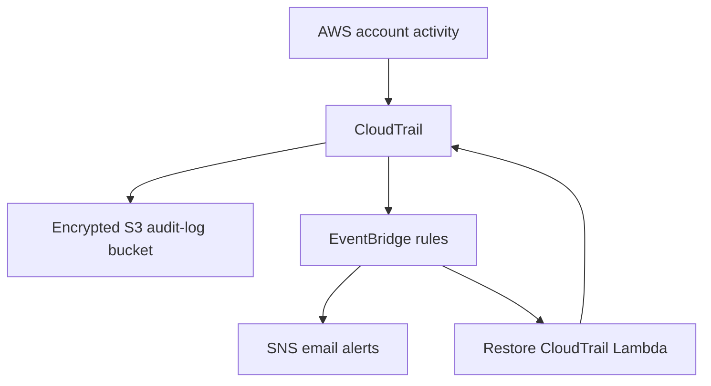

# Day 13 — SecureCloud Sentinel Security Architecture

## Objective

SecureCloud Sentinel collects AWS audit logs, detects sensitive events, sends email alerts, and automatically restores CloudTrail logging if it is stopped.

## Architecture

## Components

| Component | AWS service | Security role |
|---|---|---|
| Audit collection | CloudTrail | Records AWS management and S3 data events |
| Log storage | Amazon S3 | Stores audit logs with SSE-S3 encryption, versioning, lifecycle rules, and public-access block |
| Event detection | Amazon EventBridge | Detects sensitive IAM, S3, CloudTrail, and failed console-login events |
| Alerting | Amazon SNS | Sends email notifications for critical events |
| Automated response | AWS Lambda | Restarts CloudTrail when logging is stopped |
| Infrastructure as Code | Terraform | Defines, validates, and tracks AWS resources |
| CI security gate | GitHub Actions + Trivy | Validates Terraform and scans IaC misconfigurations on every push |

## Detection and Response Flows

### CloudTrail stop attempt

1. An AWS identity calls the `StopLogging` API.
2. CloudTrail records the event.
3. EventBridge matches the CloudTrail-stop rule.
4. EventBridge invokes the Lambda function.
5. Lambda calls `StartLogging` for `securecloud-sentinel-audit`.
6. SNS sends an email notification.
7. CloudTrail logging continues.

### Failed root-console login

1. A failed AWS root-console login occurs.
2. CloudTrail records `ConsoleLogin` with `Failure`.
3. The EventBridge rule in `us-east-1` matches the event.
4. EventBridge publishes the alert to SNS.
5. SNS sends an email notification.

## Security Controls

- S3 public access is blocked.
- Audit-log bucket versioning is enabled.
- S3 audit logs are encrypted at rest with SSE-S3 (`AES256`).
- CloudTrail log-file validation is enabled.
- EventBridge SNS permissions are restricted to the expected rules.
- Lambda permissions are restricted to the CloudTrail recovery workflow.
- Terraform code is checked automatically on every push.
- Trivy scans Terraform misconfigurations rated HIGH or CRITICAL.

## Lab Design Decisions

This student lab intentionally uses AWS-managed encryption instead of customer-managed KMS keys. This avoids unnecessary KMS costs while keeping S3 audit logs encrypted and preserving EventBridge-to-SNS alert delivery.

These exceptions are documented narrowly with `#trivy:ignore` comments. The rest of the Terraform configuration remains scanned by Trivy.

## Validation Evidence

- CloudTrail logs were confirmed in S3.
- CloudTrail automatic recovery was tested successfully.
- A failed root-console login generated an SNS email alert.
- `terraform plan` returned `No changes`.
- GitHub Actions workflow completed successfully.